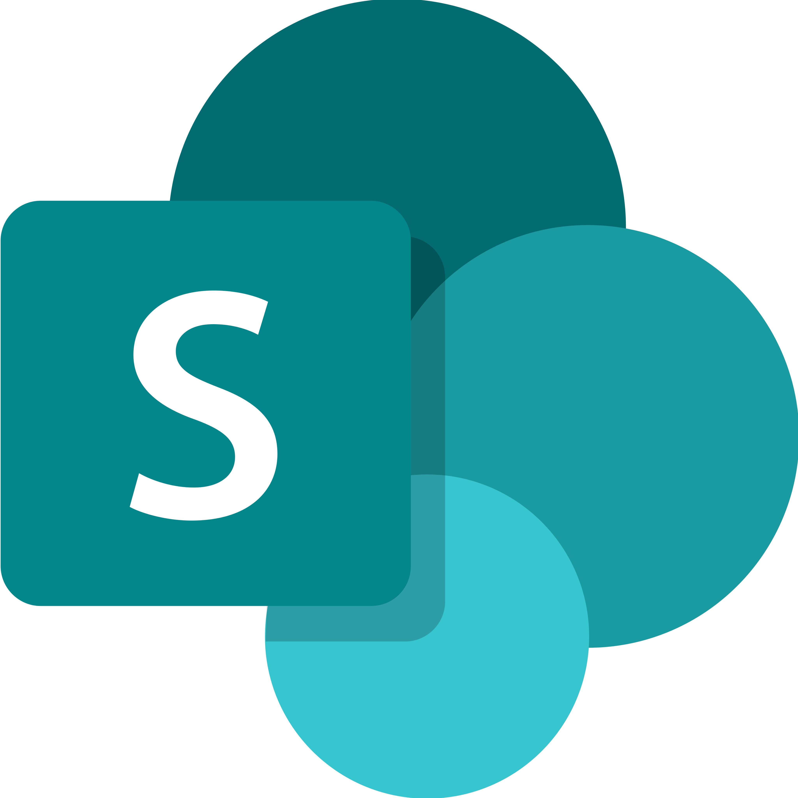

  <h1>👋 ¡Hola! Soy Andrés Velásquez</h1>

<!--
**sirbate/sirbate** is a ✨ _special_ ✨ repository because its `README.md` (this file) appears on your GitHub profile.

Here are some ideas to get you started:

- 🔭 I’m currently working on ...
- 🌱 I’m currently learning ...
- 👯 I’m looking to collaborate on ...
- 🤔 I’m looking for help with ...
- 💬 Ask me about ...
- 📫 How to reach me: ...
- 😄 Pronouns: ...
- ⚡ Fun fact: ...
-->
  <ul>
    <li>🛠️ Actualmente creando soluciones empresariales con Power Apps, Power Automate.</li>
    <li>🌱 Siempre estoy aprendiendo algo nuevo. Hoy es diseño UI/UX, mañana... quién sabe. ¡Vamos por más!</li>
    <li>🎯 Me apasiona convertir procesos complejos en apps simples, funcionales y bien diseñadas.</li>
    <li>🤝 Abierto a colaborar en proyectos que combinen innovación, automatización. ¿Tienes uno? ¡Hablemos!</li>
    <li>💬 Pregúntame sobre desarrollo low-code, automatización de flujos o cómo sobrevivir a la primera app con Power Platform 😄</li>
    <li>📬 Puedes contactarme en: <a href="mailto:serdna2010@gmail.com">serdna2010@gmail.com</a>
    <li>🔗 También en <a href="https://www.linkedin.com/in/andresvelasquezb/" target="_blank">LinkedIn</a></li>
  </ul>
<!-- Hero Section
-->
<h2>🧃 Fuera del teclado...</h2>
<ul style="list-style: none; padding-left: 0; line-height: 1.8;">

  <li>🎬 Fan del buen <strong>cine</strong> y las <strong>series que te hacen cuestionar la vida</strong>.</li>
  <li>✈️ <strong>Viajar</strong> es el mejor <em>debug</em> mental.</li>
  <li>🌱 Tengo más <strong>plantas</strong> que excusas para no regarlas.</li>
  <li>⚽ Apasionado por el <strong>fútbol</strong>, aunque mi equipo me haga sufrir.</li>
  <li>🏎️ Sí, grito en las curvas de la <strong>F1</strong>. Lo asumo.</li>
</ul>

<h2>💻 Skills</h2>

<!--- **Languages**:-->

<!-- Power Platform Stack -->

  <!-- Power Platform Core -->
  
  
  
  

  <!-- Ecosistema / Infraestructura -->
  
  
  

  <!-- IA & Extensiones -->
  

  <!-- Creatividad & Automatización externa -->
  
  

